# MNIST Classifier for Learning Explanation

This project is for finding out the feature which decides the final classification.

I intended to make this project for efficient image segmentation.
But I guess this MNIST dataset is not sufficient for implementing segmentation with this approach.

But still I could get meaningful result.
The red pixels that last for a long time in the video are brighter which means they more contribute to being classified as a certain number.

[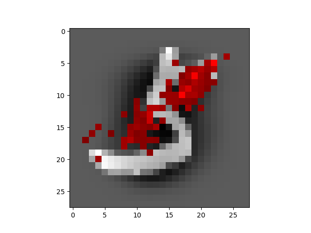](https://youtu.be/riGnxcfSY2c)

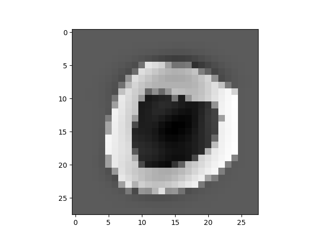
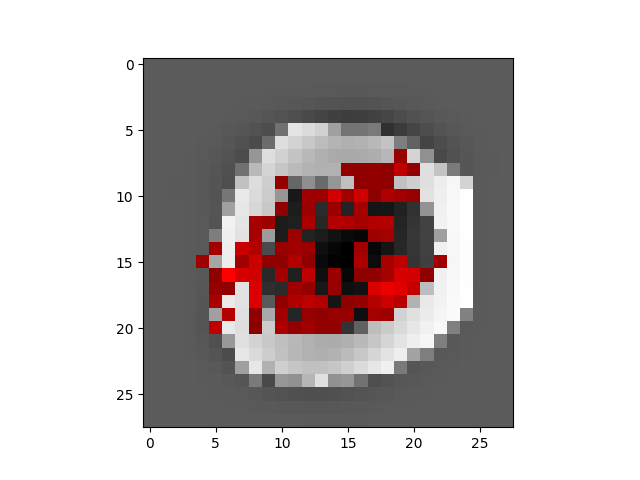
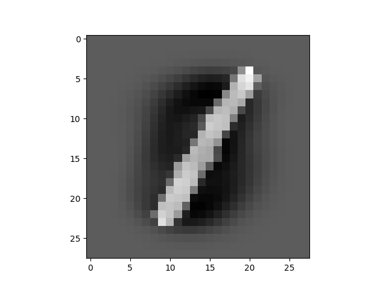
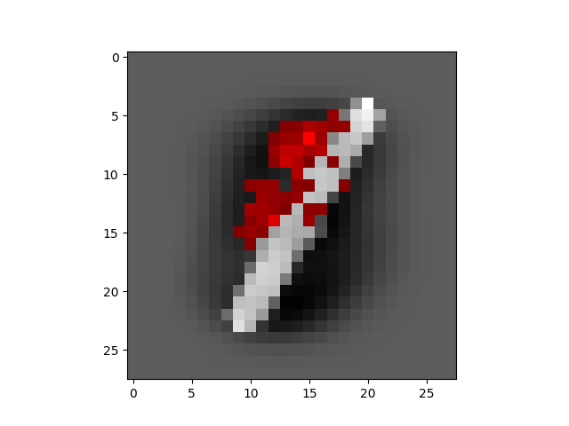
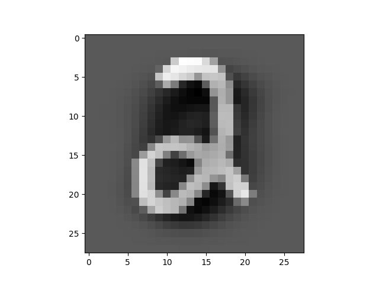
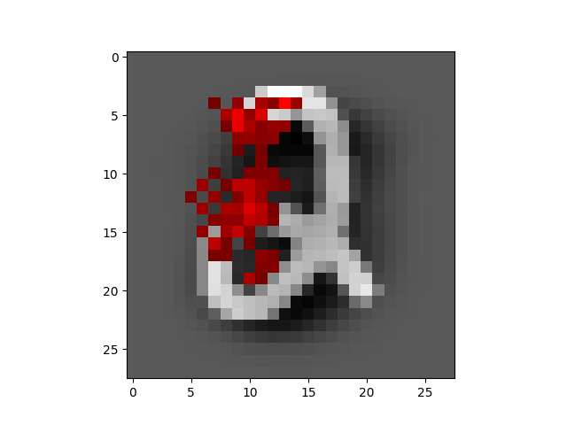
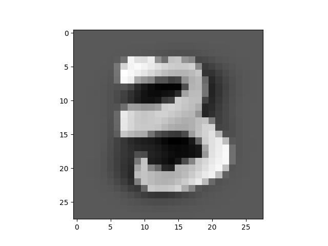
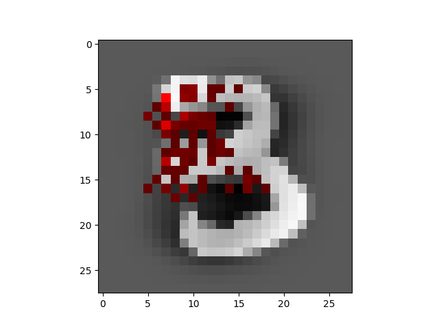
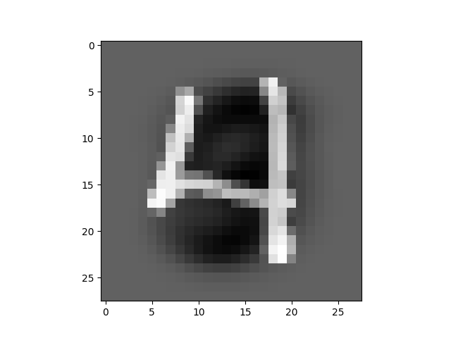
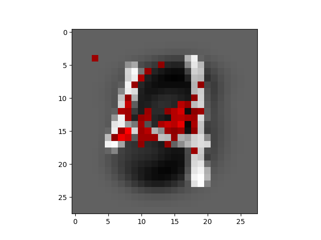
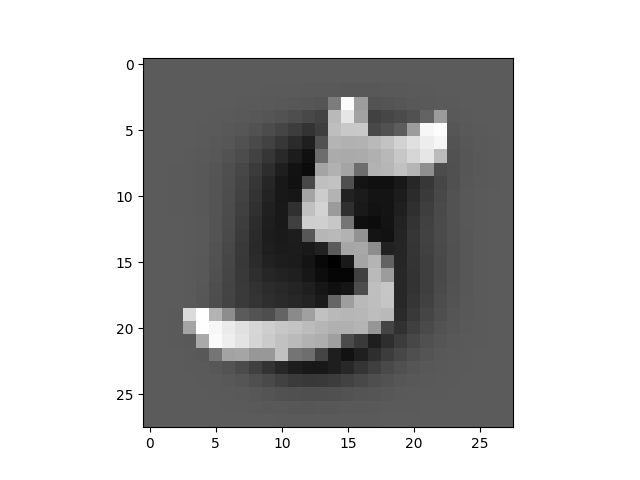

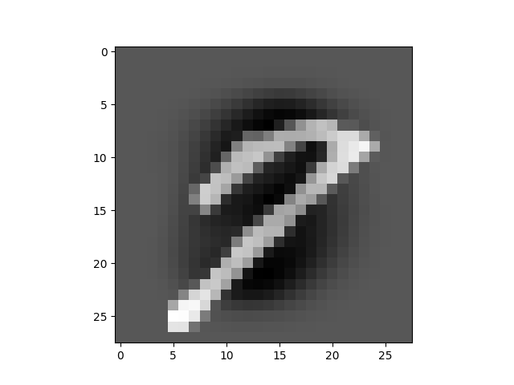
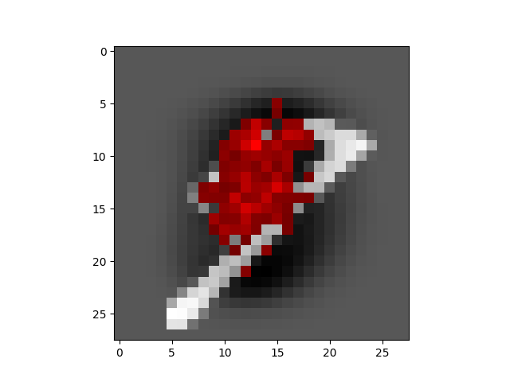
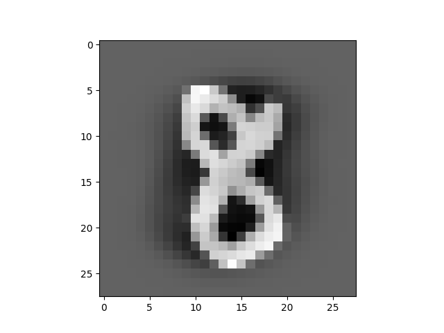
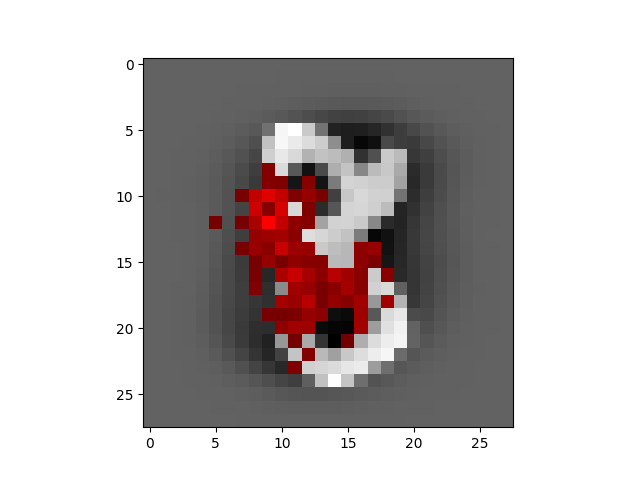
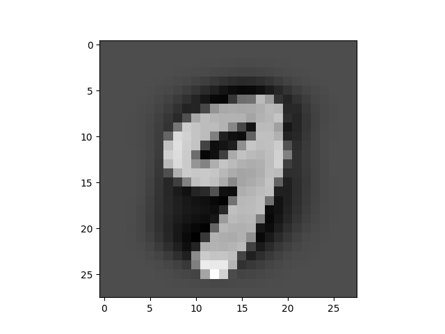
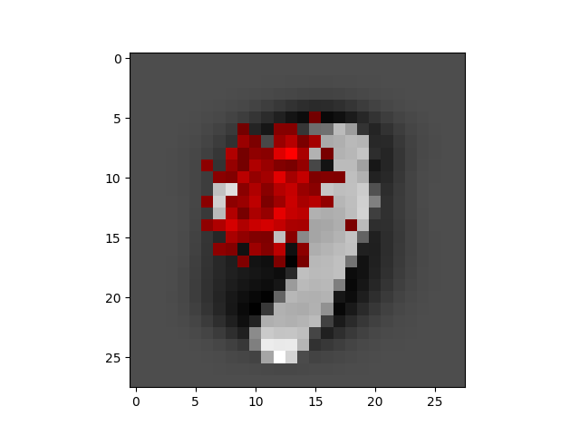
