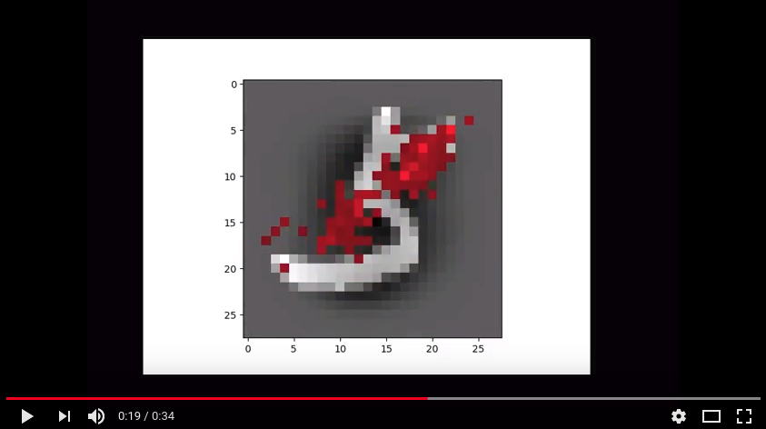

# MNIST Classifier for Learning Explanation

This project is for finding out the feature which decides the final classification.

The red pixels that last for a long time in the video are brighter which means they more contribute to being classified as a certain number.

As you can see in No.5 image the bright red pixels are placed in the area, where white pixels are placed in No.8 and No.9, so that it can easily seperate 5 from similar numbers like 8 and 9.

## Video Link

## Image Result
### Number 0

### Number 1

### Number 2

### Number 3

### Number 4

### Number 5

### Number 6

### Number 7

### Number 8

### Number 9

